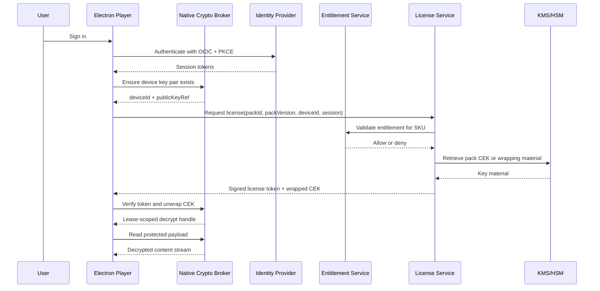
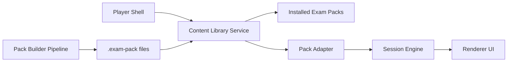

# Design: Player and Exam Pack Architecture

## Current State

The current runtime flow is simple and tightly coupled:

1. Electron starts.
2. `src/main.js` locates one bundled `questions.db`.
3. The app reads one `questions` table.
4. The renderer treats the result as the only available exam bank.

This is efficient for one exam, but it does not scale to multiple products.

## Target Architecture

### Core Components

1. `Player Shell`
   Electron app, navigation, settings, storage, import flow, update flow, session engine.

2. `Content Library Service`
   Discovers installed exam packs, validates manifests, resolves active pack, exposes searchable pack metadata.

3. `Pack Adapter`
   Converts the selected pack into the normalized runtime model expected by the renderer.

4. `Session Engine`
   Builds practice sessions and timed exams from the active pack, independent of vendor.

5. `Pack Builder Pipeline`
   Converts raw extracted source files into installable exam packs.

## Recommended Storage Layout

Do not store packs inside the app installation directory after import.

Recommended per-user content location:

`%APPDATA%/ServerPlusExamPrep/packs/<pack-id>/<pack-version>/`

Example:

`%APPDATA%/ServerPlusExamPrep/packs/comptia-serverplus-sk0-005/1.0.0/`

Benefits:

- content survives player upgrades
- multiple packs can coexist
- imports do not require admin rights
- corrupted packs can be removed independently

## Exam Pack Format

Recommended pack extension:

- `.exam-pack`

Recommended MIME-style identity:

- `application/x-exam-pack`

Recommended archive layout:

```text
comptia-serverplus-sk0-005.exam-pack
  manifest.json
  content.db
  assets/
  checksums.json
  signature.json
```

## Pack Format Specification

The pack should be a deterministic archive with a clearly defined root layout.

### Root Files

- `manifest.json`
  Required. Human-readable metadata, compatibility rules, commercial metadata, and content entrypoints.

- `content.db`
  Required in the first version. SQLite content payload for questions, options, objectives, tags, and asset references.

- `assets/`
  Optional but expected for image-heavy packs. Stores prompt, option, and explanation assets.

- `checksums.json`
  Required. Hash list for all files in the pack except the signature file.

- `signature.json`
  Optional in early development, recommended for production. Contains a publisher signature over the manifest and checksum payload.

### Required Archive Rules

- All paths use forward slashes.
- No absolute paths.
- No path traversal entries such as `../`.
- Asset references inside `content.db` are relative to the pack root.
- File names should be stable and ASCII-safe where practical.
- The pack must be installable without network access after it has been authorized.

### Example Archive Layout

```text
comptia-serverplus-sk0-005.exam-pack
  manifest.json
  content.db
  checksums.json
  signature.json
  assets/
    prompts/
      q-00058-1.jpg
    options/
      q-00126-b-1.jpg
    explanations/
      q-00126-exp-1.jpg
```

### Manifest Example

```json
{
  "schemaVersion": "1.0",
  "packId": "comptia-serverplus-sk0-005",
  "packVersion": "1.0.0",
  "title": "CompTIA Server+",
  "vendor": "CompTIA",
  "product": "Server+",
  "examCode": "SK0-005",
  "certification": "Server+",
  "language": "en",
  "questionCount": 424,
  "distribution": {
    "publisher": "Your Company",
    "channel": "official",
    "releaseDate": "2026-04-22"
  },
  "compatiblePlayer": {
    "min": "1.2.0",
    "max": "2.x"
  },
  "licensing": {
    "model": "subscription_or_credit",
    "sku": "pack.comptia.serverplus.sk0-005",
    "requiresEntitlement": true,
    "offlineLeaseHours": 168
  },
  "modes": {
    "practice": true,
    "timedExam": true
  },
  "examProfile": {
    "maxQuestions": 90,
    "defaultDurationMinutes": 90
  },
  "entry": {
    "database": "content.db"
  },
  "hashes": {
    "algorithm": "sha256",
    "checksumsFile": "checksums.json"
  },
  "security": {
    "signature": "signature.json",
    "contentEncryption": "optional"
  }
}
```

### Recommended Manifest Fields

Identity fields:

- `schemaVersion`
- `packId`
- `packVersion`
- `title`
- `vendor`
- `product`
- `certification`
- `examCode`
- `language`

Catalog fields:

- `questionCount`
- `distribution.publisher`
- `distribution.channel`
- `distribution.releaseDate`

Compatibility fields:

- `compatiblePlayer.min`
- `compatiblePlayer.max`

Business fields:

- `licensing.model`
- `licensing.sku`
- `licensing.requiresEntitlement`
- `licensing.offlineLeaseHours`

Payload fields:

- `entry.database`
- `hashes.algorithm`
- `hashes.checksumsFile`
- `security.signature`
- `security.contentEncryption`

## checksums.json Format

Recommended example:

```json
{
  "algorithm": "sha256",
  "files": {
    "manifest.json": "2fc1...",
    "content.db": "a912...",
    "assets/prompts/q-00058-1.jpg": "c183..."
  }
}
```

The player should validate this before installation and again before first use after installation.

## signature.json Format

Recommended example:

```json
{
  "keyId": "publisher-key-2026-01",
  "algorithm": "ed25519",
  "signedFiles": [
    "manifest.json",
    "checksums.json"
  ],
  "signature": "base64-signature-value"
}
```

The player should trust only known publisher keys embedded in the app or fetched from your license service.

## Normalized Runtime Data Model

The renderer should consume a vendor-agnostic model.

### Pack

```ts
type ExamPack = {
  packId: string;
  packVersion: string;
  title: string;
  vendor: string;
  product: string;
  examCode: string;
  language: string;
  questionCount: number;
  examProfile?: {
    maxQuestions?: number;
    defaultDurationMinutes?: number;
  };
};
```

### Question

```ts
type ExamQuestion = {
  id: string;
  sequence?: number;
  prompt: string;
  promptImages: string[];
  options: {
    id: string;
    label: string;
    text: string;
    images: string[];
  }[];
  answerKey: string[];
  explanation?: string;
  explanationImages: string[];
  tags?: string[];
  objectiveRefs?: string[];
  metadata?: Record<string, string>;
};
```

This lets the player support:

- single answer
- multiple answer
- future hotspot/simulation question metadata
- objective filtering
- vendor-specific metadata without breaking the renderer

## Recommended Database Shape

If you keep SQLite in the pack, the schema should become content-platform oriented, not single-exam oriented.

Recommended tables:

- `packs`
- `questions`
- `options`
- `question_assets`
- `explanation_assets`
- `objectives`
- `question_objectives`
- `tags`
- `question_tags`

### Suggested Minimal Table Layout

`packs`

- `id TEXT PRIMARY KEY`
- `pack_version TEXT NOT NULL`
- `title TEXT NOT NULL`
- `vendor TEXT NOT NULL`
- `product TEXT NOT NULL`
- `exam_code TEXT NOT NULL`
- `language TEXT NOT NULL`

`questions`

- `id TEXT PRIMARY KEY`
- `pack_id TEXT NOT NULL`
- `question_type TEXT NOT NULL DEFAULT 'multiple_choice'`
- `sequence INTEGER`
- `prompt TEXT NOT NULL`
- `answer_key TEXT NOT NULL`
- `explanation TEXT`
- `difficulty TEXT`
- `metadata_json TEXT NOT NULL DEFAULT '{}'`

`options`

- `id TEXT PRIMARY KEY`
- `question_id TEXT NOT NULL`
- `label TEXT NOT NULL`
- `text TEXT NOT NULL`
- `sort_order INTEGER NOT NULL`

`question_assets`

- `id TEXT PRIMARY KEY`
- `question_id TEXT NOT NULL`
- `asset_role TEXT NOT NULL`
- `path TEXT NOT NULL`
- `sort_order INTEGER NOT NULL`

`explanation_assets`

- `id TEXT PRIMARY KEY`
- `question_id TEXT NOT NULL`
- `path TEXT NOT NULL`
- `sort_order INTEGER NOT NULL`

`objectives`

- `id TEXT PRIMARY KEY`
- `pack_id TEXT NOT NULL`
- `code TEXT NOT NULL`
- `title TEXT NOT NULL`

`question_objectives`

- `question_id TEXT NOT NULL`
- `objective_id TEXT NOT NULL`

`tags`

- `id TEXT PRIMARY KEY`
- `pack_id TEXT NOT NULL`
- `name TEXT NOT NULL`

`question_tags`

- `question_id TEXT NOT NULL`
- `tag_id TEXT NOT NULL`

## Pack Lifecycle States

The player should treat a pack as moving through these states:

1. `Downloaded`
2. `Validated`
3. `Authorized`
4. `Installed`
5. `Active`
6. `Expired` or `Revoked`

This matters for subscription and credit logic because installation and entitlement are not the same thing.

## Security Model for Packs

There are four increasing levels of protection:

1. `Plain pack`
  Zip + manifest + checksum only. Good for development, weak for paid content.

2. `Signed pack`
  Prevents tampering and fake publishers, but does not hide the content from a determined user.

3. `Encrypted pack`
  Hides the payload at rest, but the player still needs a decryption key somewhere.

4. `Entitlement-controlled encrypted pack`
  Pack is encrypted, the player obtains a short-lived content key after entitlement verification, and offline use is time-limited.

If the product is commercial, the realistic production target is level 4.

## Recommended Security Architecture

Do not think in terms of `protect the pack` versus `protect the player` as separate choices.

The real control plane is:

- protect entitlement decisions on the server
- sign both player and pack releases
- optionally encrypt pack payloads
- issue time-bounded offline leases to the player

Recommended runtime flow:

1. User signs in.
2. Player asks license service for entitlements.
3. Service returns allowed SKUs and an offline lease.
4. If a protected pack is imported or downloaded, the player requests a pack key.
5. Service returns a short-lived decryption token only if the entitlement is valid.
6. Player installs and locally caches only what is necessary for the lease period.

This gives you better commercial control than relying on local obfuscation alone.

## Recommended DRM Model

If you want a simple but powerful DRM design, use an `RMS-like license token` model instead of inventing a complicated always-online DRM stack.

Core idea:

- each pack is encrypted with a random `content encryption key` or `CEK`
- the pack does not contain the CEK in plaintext
- after authentication and entitlement validation, the service issues a signed short-lived `license token`
- the license token contains a `wrapped CEK` that only the official player can unwrap locally

This is simple enough to operate, but much stronger than just hiding a SQLite file inside the app.

### Key Roles

- `Publisher signing key`
  Signs the pack manifest and checksums.

- `Pack CEK`
  Symmetric key used to encrypt `content.db` and optionally sensitive assets.

- `License service signing key`
  Signs the DRM license token returned after authentication.

- `Player device key pair`
  Generated on first sign-in or first protected activation. Private key is protected locally with Windows DPAPI. Public key is registered with the license service.

### Recommended Pack Layout for DRM Packs

For protected packs, extend the pack layout like this:

```text
comptia-serverplus-sk0-005.exam-pack
  manifest.json
  payload/content.db.enc
  payload/assets/...optional encrypted files...
  checksums.json
  signature.json
```

In this model:

- `content.db` is replaced by `payload/content.db.enc`
- the manifest points to the encrypted payload
- the CEK never ships in plaintext

### Manifest Additions for DRM Packs

Recommended DRM section:

```json
{
  "security": {
    "signature": "signature.json",
    "contentEncryption": "required",
    "drm": {
      "scheme": "license-token-v1",
      "contentKeyId": "cek-comptia-serverplus-sk0-005-v1",
      "payload": "payload/content.db.enc",
      "cipher": "aes-256-gcm",
      "licenseAudience": "desktop-player",
      "requiresOnlineActivation": true
    }
  }
}
```

### DRM License Token Shape

The token should be compact, signed by the service, and time-bounded.

Recommended fields:

```json
{
  "iss": "license.yourcompany.com",
  "aud": "desktop-player",
  "sub": "user-123",
  "packId": "comptia-serverplus-sk0-005",
  "packVersion": "1.0.0",
  "sku": "pack.comptia.serverplus.sk0-005",
  "deviceId": "device-abc",
  "licenseId": "lic-789",
  "entitlementType": "subscription",
  "offlineLeaseExpiresAt": "2026-04-29T12:00:00Z",
  "wrappedKey": "base64-encrypted-cek-for-device",
  "keyWrapAlgorithm": "rsa-oaep-256",
  "contentCipher": "aes-256-gcm"
}
```

Recommended transport and signature options:

- signed JWT with asymmetric signature, or
- PASETO public token if you want a smaller safer-by-default format

Either is fine. The important properties are:

- signed by the service
- audience-bound to your player
- pack-bound
- device-bound
- time-bounded

### Activation Flow

Recommended runtime flow:

1. User signs into the player.
2. Player proves identity to the license service.
3. Player sends `packId`, `packVersion`, `deviceId`, and its registered public key reference.
4. Service checks entitlement and pack policy.
5. Service retrieves the CEK for that pack version.
6. Service wraps the CEK to the player device public key.
7. Service returns a signed license token containing the wrapped CEK and lease expiry.
8. Player verifies the token signature.
9. Player unwraps the CEK locally using its private key protected by DPAPI.
10. Player decrypts the pack payload in memory or into a tightly controlled local cache.

### Offline Lease Behavior

For usability, the token should support bounded offline use.

Recommended policy:

- token lease: 3 to 14 days
- player may reuse cached wrapped key and token until lease expiry
- on expiry, player must revalidate online
- revoked subscriptions invalidate the next license refresh

This keeps the experience usable without making the pack permanently free after one activation.

### Local Storage Guidance

To keep the design simple and safer:

- do not store the CEK in plaintext on disk
- store the device private key using Windows DPAPI
- store the signed license token and wrapped CEK in local app data
- decrypt in memory where possible
- if you cache decrypted content, bind it to the lease and purge it on expiry

### Why This Model Works Better

If the pack is copied:

- the encrypted payload is not enough by itself
- another machine still needs a valid entitlement and device-bound license token

If the player is patched:

- a patched UI can skip some local checks
- but it still cannot mint a valid signed license token or unwrap a CEK for a different device without the service and protected private key

This is not perfect DRM, but it is a strong practical commercial control for an Electron product.

## Enterprise DRM Profile

For the enterprise-grade version of this design, add a stronger separation between UI, crypto, and policy enforcement.

### Enterprise Components

1. `Electron Player`
  Hosts UI, user session, pack library, and IPC orchestration.

2. `Native Crypto Broker`
  A signed native Windows component responsible for device keys, CEK unwrap, and pack decrypt operations.

3. `Identity Provider`
  Authenticates the user and issues session tokens.

4. `Entitlement Service`
  Decides whether the authenticated user is allowed to open a given SKU.

5. `License Service`
  Issues short-lived signed license tokens and device-wrapped content keys.

6. `Key Management Service`
  Protects master wrapping keys and pack key material.

### Recommended Trust Boundaries

- Electron renderer is not trusted with long-lived secrets.
- Electron main process is orchestration, not key custody.
- Native broker is the only local component allowed to unwrap CEKs.
- License service is the policy authority for decryption.
- KMS or HSM is the authority for root key custody.

### Player-Only Authorization Goal

Your requirement is:

- user authenticates in the player
- decryption requires authenticated session
- only the player may request decryption

The practical enterprise interpretation is:

- only an authenticated session can request a license
- only a registered player device key can receive a usable wrapped CEK
- only the signed native broker can unwrap the CEK locally

This is the strongest realistic desktop control model without claiming impossible guarantees.

### Reference Sequence



See `05-enterprise-drm-spec.md` for the strict API and token contract.

Notes:

- `questions.id` should be a stable content identifier, not a UI position.
- UI numbering should always be session-based and derived from current ordering.
- The pack can include one or many exams later if you want to group related codes.

## Player APIs

Add a content-focused IPC surface.

Recommended IPC contract:

- `packs:list`
- `packs:getActive`
- `packs:setActive`
- `packs:import`
- `packs:remove`
- `questions:listForPack`
- `session:create`

This is better than a single `questions:list` endpoint because the player will need pack selection and library management.

## Import Strategy

Recommended initial import flow:

1. User chooses `.exam-pack` file.
2. Player extracts to temp directory.
3. Validate manifest, schema version, and checksums.
4. Reject if incompatible.
5. Install into user pack library.
6. Register pack in player metadata store.

## Backward Compatibility Strategy

Do not remove Server+ content immediately.

First convert the current bundled bank into the first official exam pack:

- `comptia-serverplus-sk0-005.exam-pack`

Then let the player load it through the new library service, even if it still ships as a starter pack in the installer for one release.

That gives you a safe migration path:

- same content
- same UX behavior
- new architecture underneath

## Security and Integrity

If you plan to distribute paid or official packs later, design for integrity now.

Recommended checks:

- manifest schema validation
- file checksum validation
- compatibility version checks
- optional pack signature verification in a later phase

## Architecture Summary

