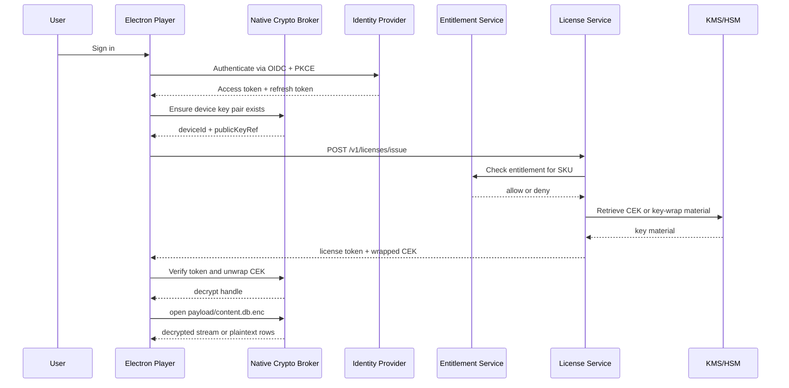

# Enterprise DRM Specification

## Goal

Define an enterprise-grade DRM design for exam packs with these requirements:

1. User authenticates in the app.
2. Using the authenticated session, the player requests decryption rights for a protected exam pack.
3. Without authentication, there is no decryption.
4. Decryption is authorized only through the official player path.

## Design Summary

Use a `license-service DRM` architecture.

- Protected packs are encrypted at rest.
- The player authenticates the user with a standard identity flow.
- The player requests a pack license using that authenticated session.
- The license service verifies entitlement and device registration.
- The license service returns a short-lived signed license token and a device-wrapped content key.
- A local native broker unwraps the content key and decrypts the pack.

This is the enterprise version of the earlier RMS-like model.

## What Enterprise Means Here

Compared with a simpler DRM design, the enterprise profile adds:

- standard identity and token handling
- separate entitlement and license services
- device registration
- KMS or HSM-backed key custody
- a native crypto broker on the client
- short-lived signed licenses
- auditability, revocation, and policy controls

## Requirements Mapping

### Requirement 1

`User authenticate in the app, using the authenticated session, request decryption for the exam pack`

Implementation:

- app uses OIDC + PKCE login
- authenticated access token is presented to license service
- license request includes `packId`, `packVersion`, and `deviceId`

### Requirement 2

`Without auth there's no decryption`

Implementation:

- no valid session means no license issuance
- no license token means no wrapped content key
- no wrapped content key means no pack decryption

### Requirement 3

`Auth for decryption only authorized via player`

Implementation:

- player registers a device public key
- license service wraps the pack CEK to that player device key
- only the player-side native broker holding the private key can unwrap the CEK

Note:

On a user-controlled desktop, this can be enforced strongly in practice but not perfectly in theory. The design goal is to make the official player the only supported and operationally useful decryption path.

## Components

### 1. Electron Player

Responsibilities:

- user sign-in UX
- pack library and selection
- calling identity, entitlement, and license endpoints
- orchestrating access to the native broker

Not responsible for:

- long-lived key storage
- raw CEK custody

### 2. Native Crypto Broker

Responsibilities:

- generate and store device key pair
- verify license signatures
- unwrap wrapped CEKs
- decrypt protected pack payloads
- expose only minimal decrypt operations to the player

Windows recommendation:

- signed native helper executable or service
- private key protected by `DPAPI`
- TPM-backed protection when available

### 3. Identity Provider

Responsibilities:

- user authentication
- session issuance
- refresh token policy
- MFA and conditional access if needed

### 4. Entitlement Service

Responsibilities:

- map account to purchased or subscribed SKUs
- decide whether a user may open a pack
- return license policy inputs to the license service

### 5. License Service

Responsibilities:

- validate authenticated session
- validate device registration
- validate entitlement
- issue short-lived signed license token
- wrap CEK to device public key

### 6. KMS or HSM

Responsibilities:

- protect master wrapping keys
- protect pack key hierarchy
- support key rotation and audit logs

## Keys and Secrets

### Publisher Signing Key

Used to sign:

- `manifest.json`
- `checksums.json`

### Pack Content Encryption Key

Used to encrypt:

- `payload/content.db.enc`
- optional sensitive assets

Characteristics:

- one CEK per pack version
- rotated on major republish or compromise

### License Signing Key

Used by license service to sign license tokens.

### Device Key Pair

Generated by the native broker on first activation.

Characteristics:

- private key never leaves device
- public key registered with backend

## Pack Format for Protected Packs

Recommended archive:

```text
vendor-exam.exam-pack
  manifest.json
  payload/content.db.enc
  payload/assets/...optional encrypted content...
  checksums.json
  signature.json
```

Recommended manifest DRM block:

```json
{
  "security": {
    "signature": "signature.json",
    "contentEncryption": "required",
    "drm": {
      "scheme": "license-token-v1",
      "contentKeyId": "cek-comptia-serverplus-sk0-005-v1",
      "payload": "payload/content.db.enc",
      "cipher": "aes-256-gcm",
      "licenseAudience": "desktop-player",
      "requiresOnlineActivation": true,
      "offlineLeaseHours": 168
    }
  }
}
```

## End-to-End Sequence



## Microsoft Reference Stack

If you want a Microsoft-aligned enterprise stack, use this:

- `Microsoft Entra ID`
  User authentication, OIDC, PKCE, conditional access, MFA.

- `Azure App Service` or `Azure Container Apps`
  Host the entitlement API and license API.

- `Azure Key Vault Managed HSM` or `Azure Key Vault`
  Protect wrapping keys and support key rotation.

- `Azure SQL Database`
  Store users, devices, entitlements, SKUs, revocations, and audit records.

- `Azure Cache for Redis`
  Optional short-lived token or license cache.

- `Application Insights`
  Audit, telemetry, anomaly detection, license issuance monitoring.

### Suggested Microsoft Service Split

- `Identity`: Entra ID
- `Entitlement API`: App Service or Container Apps
- `License API`: App Service or Container Apps
- `Key custody`: Key Vault Managed HSM
- `Metadata storage`: Azure SQL Database

## API Contract

The narrative API contract below is formalized in:

- `openapi/license-service.openapi.yaml`
- `schemas/license-token.schema.json`

### 1. Register Device

`POST /v1/devices/register`

Purpose:

- register or rotate the player device public key

Request:

```json
{
  "deviceId": "device-abc",
  "platform": "windows",
  "playerVersion": "2.0.0",
  "publicKeyPem": "-----BEGIN PUBLIC KEY-----...",
  "keyAlgorithm": "rsa-oaep-256"
}
```

Response:

```json
{
  "deviceId": "device-abc",
  "status": "registered",
  "publicKeyRef": "devkey-123"
}
```

### 2. Get Effective Entitlements

`GET /v1/entitlements/me`

Purpose:

- return active access rights and credit balance

Response:

```json
{
  "accountId": "user-123",
  "entitlements": [
    "catalog.standard.monthly",
    "pack.comptia.serverplus.sk0-005"
  ],
  "credits": 14,
  "devices": [
    {
      "deviceId": "device-abc",
      "status": "active"
    }
  ]
}
```

### 3. Issue License

`POST /v1/licenses/issue`

Purpose:

- issue a short-lived decryption license for one pack on one device

Request:

```json
{
  "packId": "comptia-serverplus-sk0-005",
  "packVersion": "1.0.0",
  "sku": "pack.comptia.serverplus.sk0-005",
  "deviceId": "device-abc",
  "publicKeyRef": "devkey-123",
  "playerVersion": "2.0.0",
  "packManifestHash": "sha256-manifest-hash",
  "challenge": "nonce-from-player"
}
```

Success response:

```json
{
  "licenseToken": "signed-token-value",
  "wrappedKey": "base64-device-wrapped-cek",
  "leaseExpiresAt": "2026-04-29T12:00:00Z"
}
```

Failure response examples:

```json
{
  "error": "entitlement_required",
  "message": "Pack access not licensed for this account"
}
```

```json
{
  "error": "device_not_registered",
  "message": "Register device before requesting a license"
}
```

### 4. Refresh License

`POST /v1/licenses/refresh`

Purpose:

- renew offline lease before expiry

Request:

```json
{
  "licenseId": "lic-789",
  "packId": "comptia-serverplus-sk0-005",
  "packVersion": "1.0.0",
  "deviceId": "device-abc"
}
```

### 5. Revoke Device or License

`POST /v1/licenses/revoke`

Purpose:

- revoke compromised device or suspicious license state

## License Token Contract

The exact payload contract is defined in:

- `schemas/license-token.schema.json`

Recommended token fields:

```json
{
  "iss": "license.yourcompany.com",
  "aud": "desktop-player",
  "sub": "user-123",
  "deviceId": "device-abc",
  "licenseId": "lic-789",
  "packId": "comptia-serverplus-sk0-005",
  "packVersion": "1.0.0",
  "sku": "pack.comptia.serverplus.sk0-005",
  "rights": ["open", "practice", "timed-exam"],
  "entitlementType": "subscription",
  "iat": 1776820800,
  "exp": 1776824400,
  "offlineLeaseExpiresAt": "2026-04-29T12:00:00Z",
  "wrappedKey": "base64-device-wrapped-content-key",
  "keyWrapAlgorithm": "rsa-oaep-256",
  "contentCipher": "aes-256-gcm",
  "challenge": "nonce-from-player"
}
```

Required properties:

- signed with asymmetric server key
- audience-bound to your desktop player
- device-bound
- pack-bound
- time-bounded

## Client Rules

The player and native broker should enforce these rules:

1. Reject unsigned or invalid license tokens.
2. Reject expired tokens.
3. Reject tokens whose `packId` or `packVersion` do not match the current pack.
4. Reject tokens whose `deviceId` does not match the local device.
5. Never persist plaintext CEKs.
6. Purge cached decrypt state when lease expires or device is revoked.

## Security Notes

### What This Solves Well

- pack theft alone is not enough to decrypt content
- entitlement revocation remains possible
- offline access can be bounded cleanly
- decryption rights are centrally controlled

### What This Does Not Solve Perfectly

- a determined reverse engineer may still extract plaintext during runtime
- a compromised machine is never fully trustworthy
- desktop-only DRM can raise cost, not create absolute secrecy

That is normal. Enterprise DRM is about strong control and containment, not magical invulnerability.

## Recommended Version 1 Scope

Implement this first:

1. OIDC login
2. device registration
3. encrypted `content.db`
4. license issuance endpoint
5. signed license token
6. native broker unwrap and decrypt
7. 3 to 7 day offline lease

Do not start with advanced attestation, watermarking, or always-online streaming. Add those only if needed later.

## Related Artifacts

- `openapi/license-service.openapi.yaml`
- `schemas/exam-pack-manifest.schema.json`
- `schemas/license-token.schema.json`